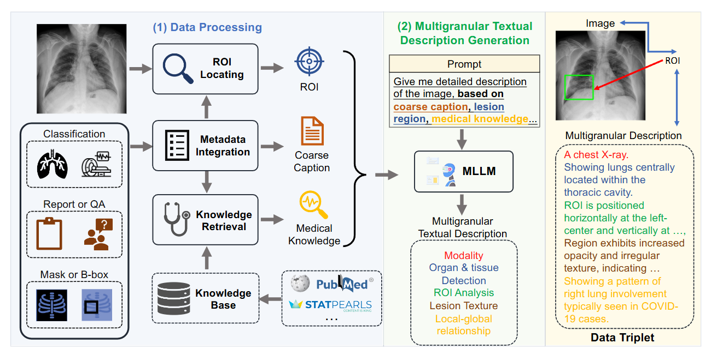
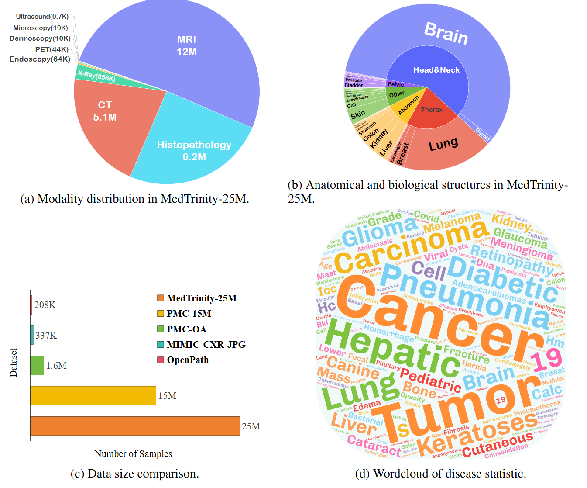
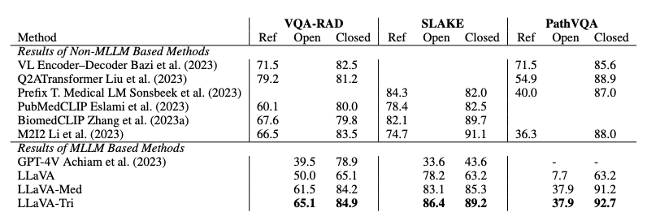

# <div align="center"> MedTrinity-25M: A Large-scale Multimodal Dataset with Multigranular Annotations for Medicine <div>


<div align="center">
  <a href="https://github.com/UCSC-VLAA/MedTrinity-25M"></a>  
  <a href="https://yunfeixie233.github.io/MedTrinity-25M"></a>  
  <a href="https://huggingface.co/datasets/UCSC-VLAA/MedTrinity-25M"></a>  
  <a href="https://arxiv.org/abs/2408.02900"></a>  
</div>

---

> [**MedTrinity-25M: A Large-scale Multimodal Dataset with Multigranular Annotations for Medicine**](https://yunfeixie233.github.io/MedTrinity-25M/)<br>
> [Yunfei Xie*](https://yunfeixie233.github.io/), [Ce Zhou*](https://github.com/Skylight-Lark),
> [Lang Gao*](https://heartyhaven.github.io/), [Juncheng Wu*](https://chtholly17.github.io/),
> [Xianhang Li](https://xhl-video.github.io/xianhangli/), [Hong-Yu Zhou](https://zhouhy.org/),
> [Sheng Liu](https://shengliu66.github.io/), [Lei Xing](https://profiles.stanford.edu/lei-xing),
> [James Zou](https://www.james-zou.com/),
> [Cihang Xie](https://cihangxie.github.io/),
> [Yuyin Zhou](https://yuyinzhou.github.io/)

---

## 📢 Breaking News
- **[🆕💥 August 31, 2024] Detailed tutorial for deploying MedTrinity now available at [HuggingFace](https://huggingface.co/datasets/UCSC-VLAA/MedTrinity-25M#dataset-download-and-preparation). We apologize for any previous inconvenience.**
- [📄💥 August 7, 2024] Our [arXiv paper](https://www.arxiv.org/abs/2408.02900) is released.
- [💾 July 21, 2024] Full dataset released.
- [💾 June 16, 2024] Demo dataset released.

Star 🌟 us if you think it is helpful!!

---

## 🚀 Dataset

### Dataset construction pipeline
<p align="center">
  
</p>

1) Data processing: extracting essential information from collected data, including metadata integration to generate coarse captions, ROI locating, and medical knowledge collection.
2) Multigranular textual description generation: using this information to prompt MLLMs to generate fine-grained captions.

### Statistical overview of MedTrinity-25M

<p align="center">
  
</p>

### Statistics of MedTrinity-25M
You can view detailed statistics of MedTrinity-25M from [this link](https://docs.google.com/spreadsheets/d/1gdVahxKKB31v3K3vBq8sK6UkimzZAT1zM1kxeJKqKq4/edit?usp=sharing). 

**Note:** sometimes a single image contains multiple biological structures. The data only reflect the number of samples in which a specific biological structure is present.

### Dataset Download

 Dataset | 🤗 Huggingface Hub | 
| --- | ---: |
| MedTrinity-25M | [UCSC-VLAA/MedTrinity-25M](https://huggingface.co/datasets/UCSC-VLAA/MedTrinity-25M) |

---

## 🏆 Results
<p align="center">
  
</p>

---

## 💬 Quick Start

### Install

Using Linux system,

1. Clone this repository and navigate to the folder

```bash
git clone https://github.com/UCSC-VLAA/MedTrinity-25M.git
```

2. Install Package

```shell
conda create -n llava-med++ python=3.10 -y
conda activate llava-med++
pip install --upgrade pip  # enable PEP 660 support
pip install -e .
```

3. Install additional packages for training cases

```shell
pip install -e ".[train]"
pip install flash-attn --no-build-isolation
pip install git+https://github.com/bfshi/scaling_on_scales.git
pip install multimedeval
```

### Upgrade to latest code base

```shell
git pull
pip install -e .

# if you see some import errors when you upgrade,
# please try running the command below (without #)
# pip install flash-attn --no-build-isolation --no-cache-dir
```

### 🤖 Model-Zoo

The following table provides an overview of the available models in our zoo. For each model, you can find links to its Hugging Face page or Google drive folder.

| Model Name                            |                             Link                              | Summary                                                                                                           | Evaluation Log |
|---------------------------------------|:--------------------------------------------------------------------------:|-------------------------------------------------------------------------------------------------------------------|:--------------:|
| LLaVA-Med++ (VQA-RAD) | [Hugging Face](https://huggingface.co/yunfeixie/LLaVA-Tri-VQARAD)  | Pretrained on [LLaVA-Med Data](https://github.com/microsoft/LLaVA-Med?tab=readme-ov-file) and MedTrinity-25M (specifically the VQA-RAD training set subset), finetuning on VQA-RAD training set. | [Log](https://huggingface.co/yunfeixie/LLaVA-Tri-VQARAD/blob/main/datarad_llava-llama-med-8b-datarad-stage3-med-ft-ep15_20250627_084658_0.3.txt) |
| LLaVA-Med++ (SLAKE) | [Hugging Face](https://huggingface.co/yunfeixie/LLaVA-Tri-SLAKE)  | Pretrained on [LLaVA-Med Data](https://github.com/microsoft/LLaVA-Med?tab=readme-ov-file) and MedTrinity-25M (specifically the SLAKE training set subset), finetuning on SLAKE training set. | [Log](https://huggingface.co/yunfeixie/LLaVA-Tri-SLAKE/blob/main/slake_modeltest_answer_file_llava-llama-med-8b-stage2-finetune-slake_orift_15_20250704_012536_0.1.txt) |
| LLaVA-Med++ (PathVQA) | [Hugging Face](https://huggingface.co/yunfeixie/LLaVA-Tri-PathVQA)  | Pretrained on [LLaVA-Med Data](https://github.com/microsoft/LLaVA-Med?tab=readme-ov-file) and MedTrinity-25M (specifically the PathVQA training set subset), finetuning on PathVQA training set. | [Log](https://huggingface.co/yunfeixie/LLaVA-Tri-PathVQA/blob/main/path_vqa_modeltest_answer_file_llava-llama-med-8b-pathvqa-stage3-med-s2bs16-bs8-ft-bs32-ep3_20250707_100216_0.1.txt) |
| LLaVA-Med-Captioner     |   [Hugging Face](https://huggingface.co/UCSC-VLAA/LLaVA-Med-Captioner)    | Captioner for generating multigranular annotations fine-tuned on [MedTrinity-Instruct-200K (Coming soon)](https://github.com/UCSC-VLAA/MedTrinity-25M). | - |

### Train and Eval LLaMA-Med++
First, you need to download the base model [LLaVA-Meta-Llama-3-8B-Instruct-FT-S2](https://huggingface.co/MBZUAI/LLaVA-Meta-Llama-3-8B-Instruct-FT-S2) and download the stage1 and stage2 datasets in the [LLaVA-Med](https://github.com/microsoft/LLaVA-Med).
1. Pre-train
```bash
# stage1 training
cd MedTrinity-25M
bash ./scripts/med/llava3_med_stage1.sh

# stage2 training
bash ./scripts/med/llava3_med_stage2.sh
```
2. Finetune
```bash
cd MedTrinity-25M
bash ./scripts/med/llava3_med_finetune.sh
```
3. Eval  
First, you need to download corresponding weight from Model-Zoo and change the path in evaluation script.
Then run:
```bash
cd MedTrinity-25M
bash ./scripts/med/llava3_med_eval_batch_vqa_rad.sh
```
Here is the evaluation suite of VQA-RAD, PathVQA, and SLAKE.
[https://huggingface.co/yunfeixie/MedTrinity-25M-evalsuite](https://huggingface.co/yunfeixie/MedTrinity-25M-evalsuite


---

## 📜 Citation

If you find MedTrinity-25M useful for your research and applications, please cite using this BibTeX:

```bibtex
@misc{xie2024medtrinity25mlargescalemultimodaldataset,
      title={MedTrinity-25M: A Large-scale Multimodal Dataset with Multigranular Annotations for Medicine}, 
      author={Yunfei Xie and Ce Zhou and Lang Gao and Juncheng Wu and Xianhang Li and Hong-Yu Zhou and Sheng Liu and Lei Xing and James Zou and Cihang Xie and Yuyin Zhou},
      year={2024},
      eprint={2408.02900},
      archivePrefix={arXiv},
      primaryClass={cs.CV},
      url={https://arxiv.org/abs/2408.02900}, 
}
```

---

## 🙏 Acknowledgement
- We thank the Microsoft Accelerate Foundation Models Research Program, the OpenAI Researcher Access Program, TPU Research Cloud (TRC) program, Google Cloud Research Credits program, AWS Cloud Credit for Research program, and Lambda Cloud for supporting our computing needs.                
- Thanks for the codebase of [LLaVA-pp](https://github.com/mbzuai-oryx/LLaVA-pp), [LLaVA-Med](https://github.com/microsoft/LLaVA-Med) and [LLaVA](https://github.com/haotian-liu/LLaVA) we built upon, and our base model [LLaVA-Meta-Llama-3-8B-Instruct-FT-S2](https://huggingface.co/MBZUAI/LLaVA-Meta-Llama-3-8B-Instruct-FT-S2) that has the amazing language capabilities!

---

## Related Projects

- [LLaVA-pp](https://github.com/mbzuai-oryx/LLaVA-pp)
- [LLaVA-Med: Training a Large Language-and-Vision Assistant for Biomedicine in One Day](https://github.com/microsoft/LLaVA-Med)
- [LLaVA](https://github.com/haotian-liu/LLaVA)
